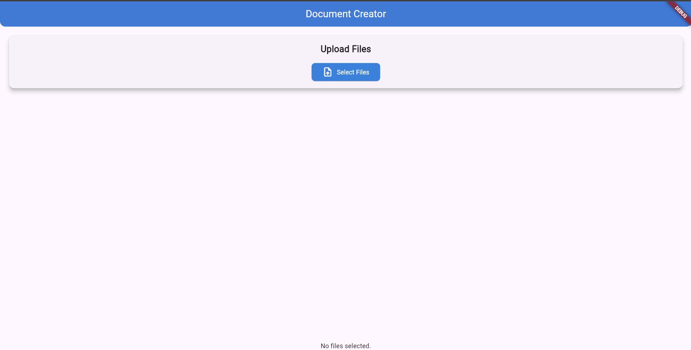
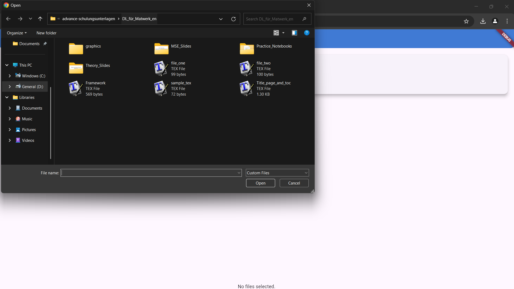
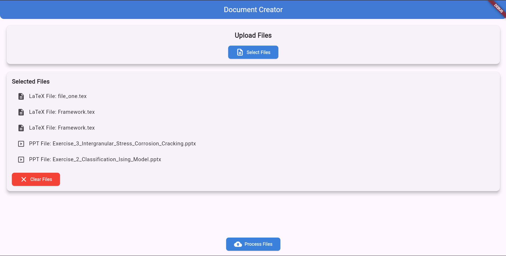
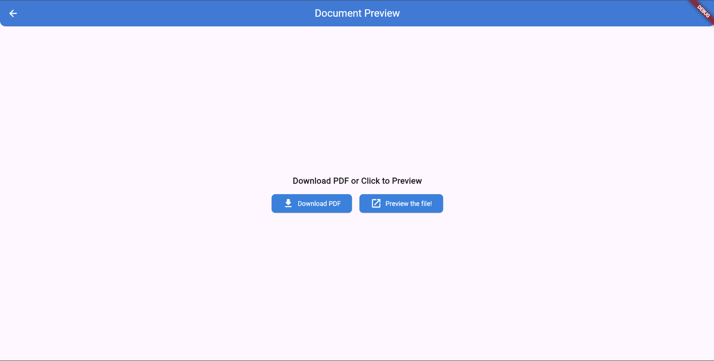
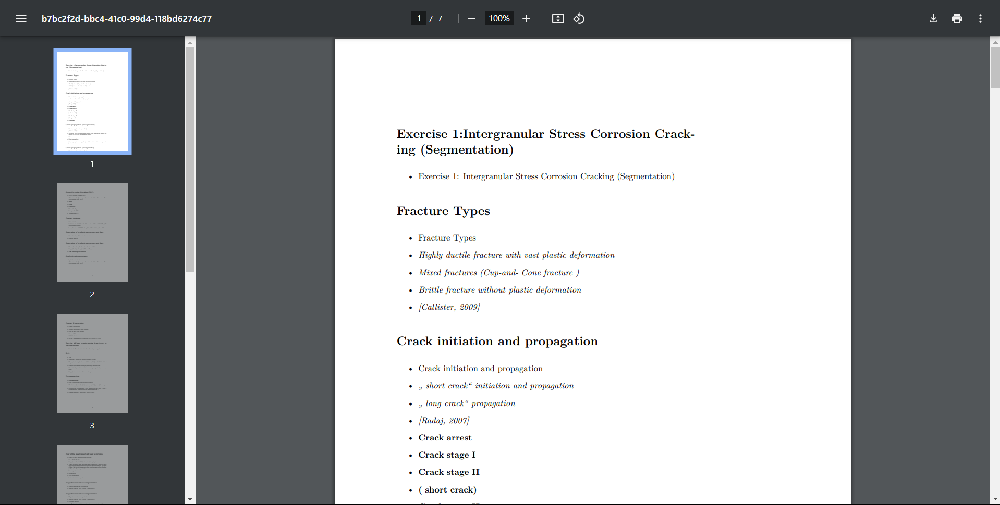

# document_generator

## About Project 

- This Project is collection of work that I did during my stay in Hochschule Aalen in duration of 6 months . 

- In this industry project the primary aim was to build production ready , maintainable and well written "WEBAPP" that converts Latex files , powerpoint and jupyter notebook to a pdf format document for academic purpose . 

- Some scripts were pre-written but they were terrbily coded and partially working , so one of the main challenges was to refactor them and make them working again . And finally convert them into API endpoints using fast api. It conatins get and post operations. Get will fetch basic details about api usage and Post will allow processing of files. 

- I had to also build the minimalistic UI for the project from scratch in flutter and uses MVVM pattern .

- Project also contains test for frontend and backend . 

## Project Images 

## Getting Started

This commands needs to be run in order to properly setup the app.

- to get latest pubs : ''' flutter pub get '''  

- make sure dependencies in requirements.txt are met . 

- ''' pip install fastapi uvicorn python-multipart pdfkit pandoc nbconvert '''

- to run fast api server : ''' uvicorn main:app --reload ''''

- if not present already create a new python env . In vs code press ctrl + shft + p then type ">Python:Create Environment" then select "Venv" then select the python version and finally "requirement.txt"

- use pytest to run tests

